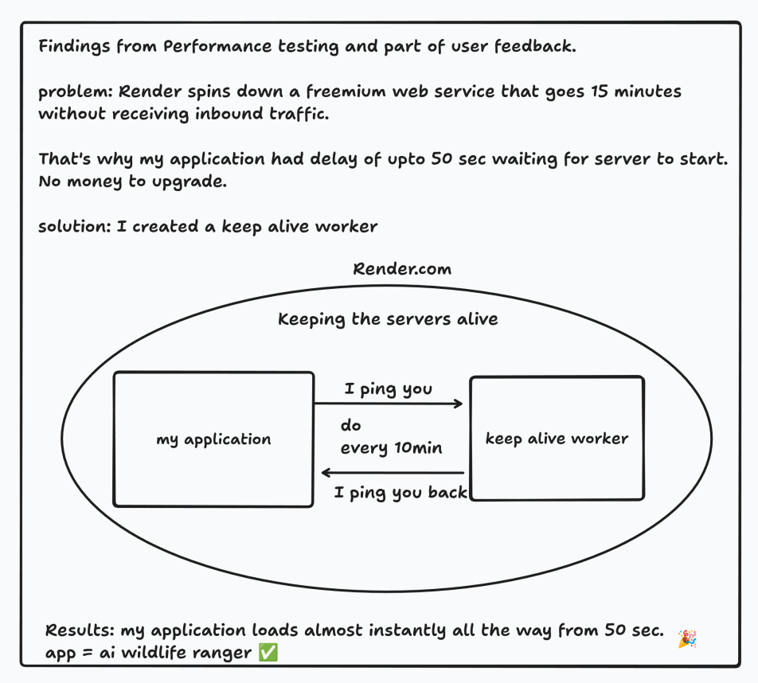

# Keep Alive Worker

This is a Flask-based app made to keep the AI Wildlife Ranger server active by periodically sending ping requests to its endpoint. It also provides a route for the ai wildlife ranger to keep this worker alive.

## Features

- Periodically sends requests to a specified endpoint -> ai wildlife ranger to keep serevr alive.
- Logs all activities (successes and failures) to a log file (`keep_alive_log.txt`).
- Provides a `/ping` endpoint to check if this worker itself is alive..

## Notes

- The `ping_app` function runs in a separate process using the `multiprocessing` module.
- The `ping_app` process is started automatically when the script is imported or executed, ensuring it works in production environments.
- Deployed on Render.com
